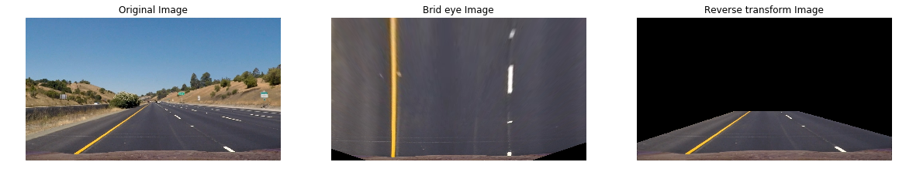
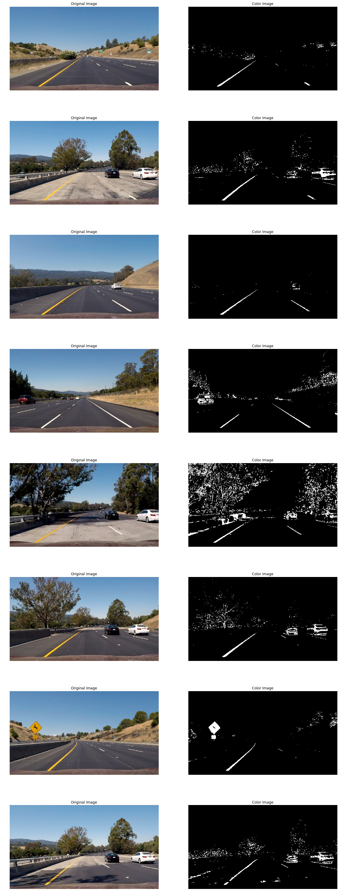
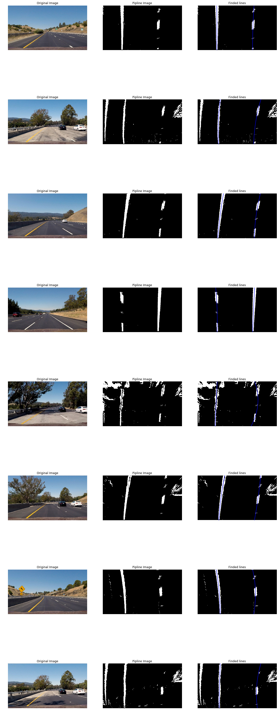

#**Advanced Lane Finding Project**
 
The main goal of the project was that to create a image pipline to dectect the lane lines from images captured by the fornt camera of self driving cars and messure the distance from center of the car.
In the next I will explain each step of the pipline 
  
###Image Transoforms
---
#### 1. Camera Calibration
The images capture by the camera has some distortion because they are not perfect (On point lense) so We need to calibrate the images before working on them. To do this We first take some pictures from chessboard and find the corners and map them to some other points. We use OpenCV to find the coreners and the mapping part. In result We have a calibration matrix to apply in the caputred images to remove the distortion

#### 2. Prespective transform

In the second part of the the pipline We apply the prespective transform to images (Bird eye view). The reason is to see the road from top and see the lane more perfectly. In this part We pick some points from original images and then transform them to see the images from top.

| Source        | Destination   | 
|:-------------:|:-------------:| 
| 220, 720      | 320, 720        | 
| 1150, 720      | 920, 720      |
| 570, 470     | 320, 0      |
| 720, 470      | 920, 0 |

#### 3. Sobel transform
To find the lane lines We apply sobel transform in both directions (x,y) and by angle and also magnitude. Then We combine the results into one image.

> gradx = abs_sobel_thresh(gray, orient='x', sobel_kernel=SOBEL_KERNEL_SIZE, thresh=(20, 255))
    grady = abs_sobel_thresh(gray, orient='y', sobel_kernel=SOBEL_KERNEL_SIZE, thresh=(70, 255))
    mag_binary = mag_sobel_thresh(gray, sobel_kernel=SOBEL_KERNEL_SIZE, thresh=(50, 255))
    dir_binary = dir_sobel_threshold(gray, sobel_kernel=SOBEL_KERNEL_SIZE, thresh=(0.6, 1.1))

#### 4. Color transform
The next step of the pipline is to find the points with saturation bounderies to get more points (Probably mroe land line points) from the images. It simply is a conversion from RGB to HLS and then apply a threshold on the S channel.

> s_binary[(s_channel >= 150) & (s_channel <= 255)] = 1

#### 5.All transform
Applying both sobel and hls filtering filter on a images.

#### 5.Region of interest
The last part is simply is a ROI filter to reduce the process and get more accurate result.

 
### Finding lines
---
#### 1.Lane finding
To find the lanes like the privious exercises We apply hot points recrangle on the image and then with a threshold find the rectangles with more white points in them (The density of pixels per  rectangle is important) and the use `np.polyfit` to fit a line to pass all of them with x degree of 2. The output image of this part is something like this

 
 
#### 2 .Distance from center
Finding distance from center is the easy part. First We average the left and right lane to find the center of the roads and then use the camera position and its diffrence with this center line and scale it to the real world.

 

### Result
---
We put all parts together

 

 
### Video pipline
---
The video pipline is simply a reading the video frame by frame and input them to the image pipline and draw the result on the output video. Some problems that might happend in the pipline are listed as below:

1. More lines! You see when some other vehicles showed up in front of the camera we find more lines and so the hot point changes after the lane finding and it's wrong. 

2. Tree's shadows. In a part of video there exists a tree. So the shadow of the tree showed up on the street. We mark them as the lines and in other ocassion, Forrest roads for example the hot points may change because of these lines and We make wrong decision finding the lanes.

3. Light reflection. For example if water on the road or snowy roads the sun reflection disable our color s channel filter. So our hot points decreases and We rely on the sobel transform much more. This aims to unreliable decision making during the lane finding.

 
### Future Works
---
The most challenging part is the thresholding. I think it's not cool and surely it's not a good approach for sovling this problem. I want to explore how can We use machine learnings approach to remove these thresholds or atleast make them more dynamics.